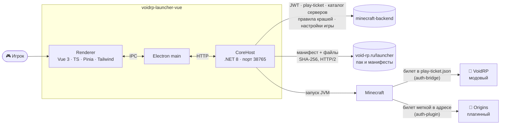
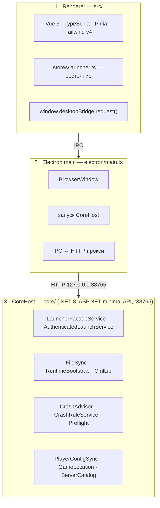
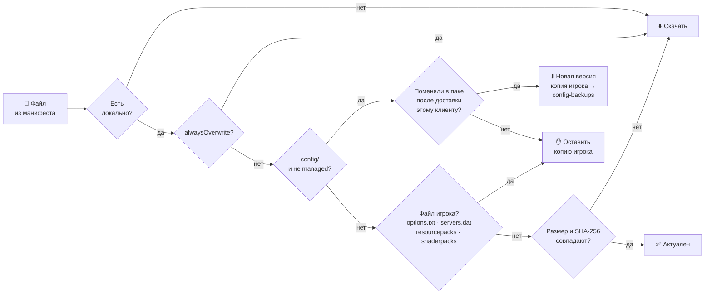

# 🚀 VoidRP Launcher

> Десктопный лаунчер VoidRP: вход в аккаунт, выбор сервера, установка и обновление модпака, Java нужной версии,
> вход в игру по одноразовому билету и помощь, если игра упала.


[](https://github.com/VOIDRP-MINECRAFT/voidrp-launcher-vue/actions/workflows/build.yml)


**[📥 Скачать лаунчер](https://void-rp.ru/download-launcher)**

---

## 🗺️ Место в экосистеме



---

## ✨ Возможности

| | |
|---|---|
| 🔐 **Аккаунт** | Вход аккаунтом VoidRP, хранение и ротация сессии; перед запуском — окно с обновлёнными документами, пока не приняты оферта и согласие на обработку ПДн |
| 🌍 **Мультисервер** | Каталог серверов с бэкенда; у каждого сервера свои файлы в `servers/<slug>/` и свой профиль (модовый NeoForge или чистый клиент для плагинных серверов) |
| 📦 **Модпак** | Синхронизация по манифесту: до 8 файлов параллельно, проверка SHA-256, удаление лишних модов |
| ☕ **Java** | Скачивает нужный рантайм сам |
| 🎫 **Вход без пароля** | Одноразовый play-ticket: модовому серверу — через файл, плагинному — меткой в адресе подключения |
| 🎛️ **Настройки игры на аккаунте** | Клавиши, графика и звук сохраняются на аккаунт (отдельно для каждого сервера) и не перезаписываются паком — переустановка или второй компьютер ничего не стоят |
| 📂 **Папка игры** | Можно перенести файлы игры на другой диск или в путь без кириллицы — с проверками и откатом при ошибке |
| 🩺 **Краш-советник** | Перед «Играть» проверяет память, место на диске и незакрытый краш; после краша разбирает лог по правилам (встроенным и присланным сервером), объясняет причину и предлагает кнопку-исправление, повторные краши эскалирует |
| 🔄 **Самообновление** | electron-updater + отдельный `VoidRpLauncher.Updater` |
| 🎨 **Интерфейс** | Темы, новости, нации, рейтинги, карта, список модов, предложение модов, обратная связь |

---

## 🏗️ Три процесса



Если ядро не поднялось, заставка показывает причину, даёт повторить и скопировать отчёт; до старта
лаунчер ждёт, пока ядро откроет порт.

---

## 🔄 Синхронизация файлов (CoreHost)

Лаунчер сверяет файлы сервера с манифестом пака (его генерирует бэкенд, URL лежит в `game_servers`)
и качает **до 8 файлов параллельно** (`Parallel.ForEachAsync`, HTTP/2). Кэш SHA-256 (`hash-cache.json`,
ключ «путь + размер + mtime») не пересчитывает хеши без нужды.



- `alwaysOverwrite` — мелкие конфиги, которые пак навязывает всегда (например, layout'ы fancymenu).
- `managed` — статичные ассеты под `config/`: сверяются по хешу, поэтому обновления доходят, а неизменное не перекачивается.
- Для каждого клиента хранится хеш версии каждого `config/`-файла, которую он получил. Без такой записи
  (первая синхронизация новой версией лаунчера) побеждает локальная копия.
- Файлы, пропавшие из манифеста, и посторонние моды убираются в резервную копию, а не удаляются насовсем.

---

## 📋 Требования

| Компонент | Версия |
|---|---|
| Node.js | 22 (как в CI) |
| .NET SDK | 8.0 |
| npm | идёт с Node |

---

## 🚀 Разработка

```bash
npm ci
npm run dev                     # renderer (Vite :5177) + CoreHost + Electron
```

| Команда | Что делает |
|---|---|
| `npm run build:core:dev:linux` | CoreHost (Debug, Linux) |
| `npm run build:electron` | Electron main process |
| `npm run build:renderer` | Renderer (Vite) |
| `npm run build:linux` | Релизная сборка под Linux |

Релизные сборки — `build-release-linux.sh` и `build-release-win-portable.ps1`.

---

## 🔗 Связанные репозитории

| Репо | Связь |
|---|---|
| [minecraft-backend](https://github.com/VOIDRP-MINECRAFT/minecraft-backend) | Аккаунт, play-ticket, каталог серверов, правила крашей, настройки игры, манифесты |
| [voidrp-auth-bridge](https://github.com/VOIDRP-MINECRAFT/voidrp-auth-bridge) | Принимает билет на модовом сервере |
| [voidrp-auth-plugin](https://github.com/VOIDRP-MINECRAFT/voidrp-auth-plugin) | Принимает билет на плагинном сервере |
| [voidrp-launcher-java](https://github.com/VOIDRP-MINECRAFT/voidrp-launcher-java) | Запасной лаунчер (JavaFX) |

---

<div align="center">
<a href="https://void-rp.ru">🌐 Сайт</a> ·
<a href="https://github.com/VOIDRP-MINECRAFT">🏠 Организация</a>
</div>
